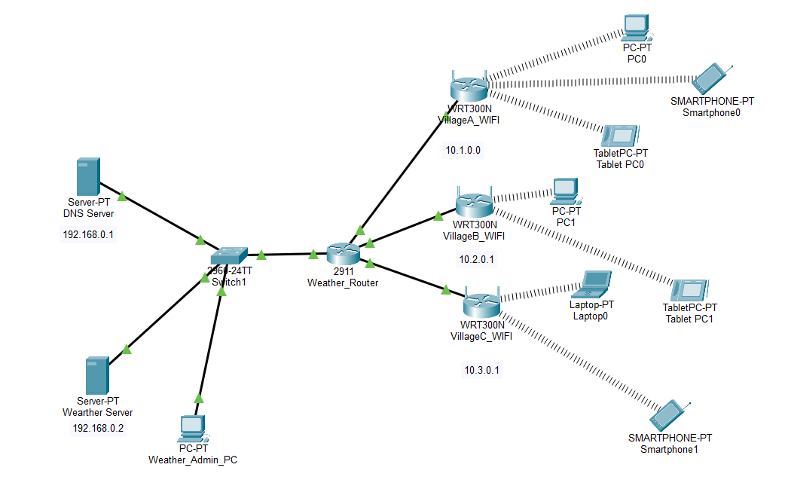
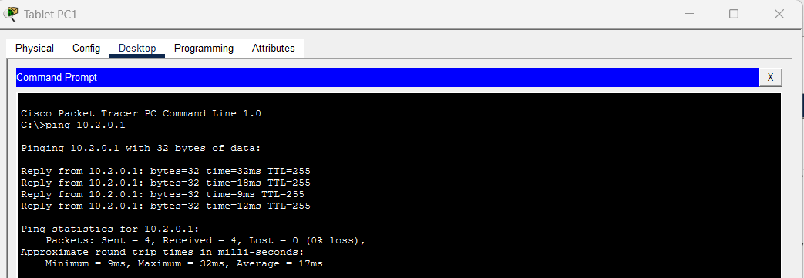
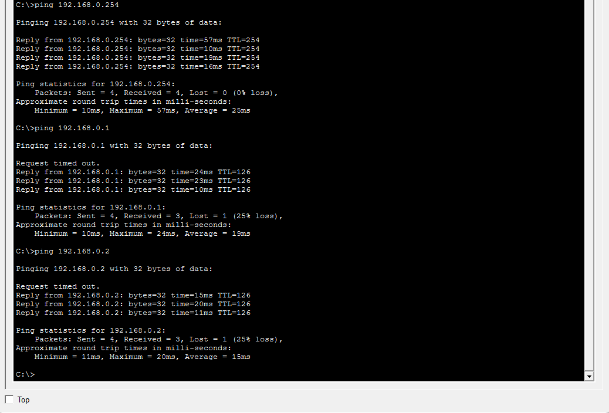
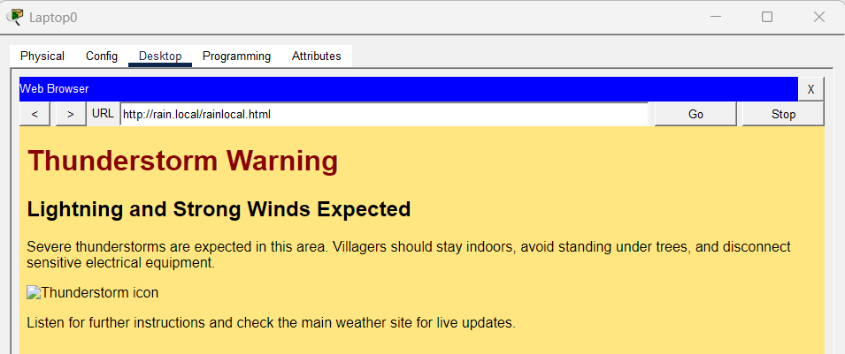
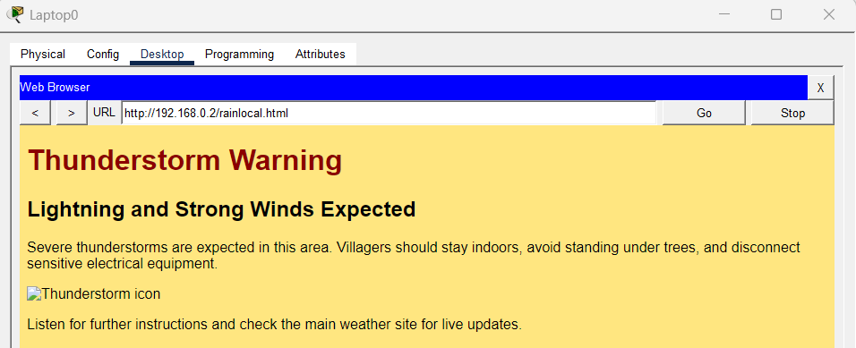
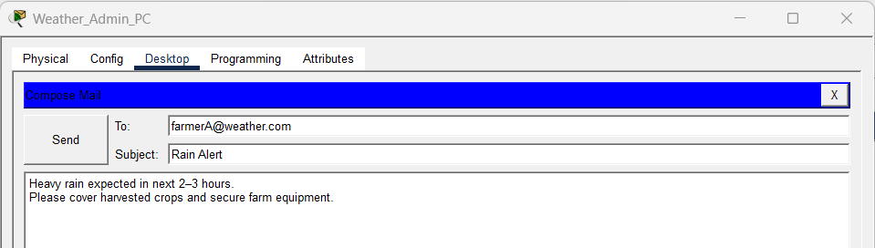
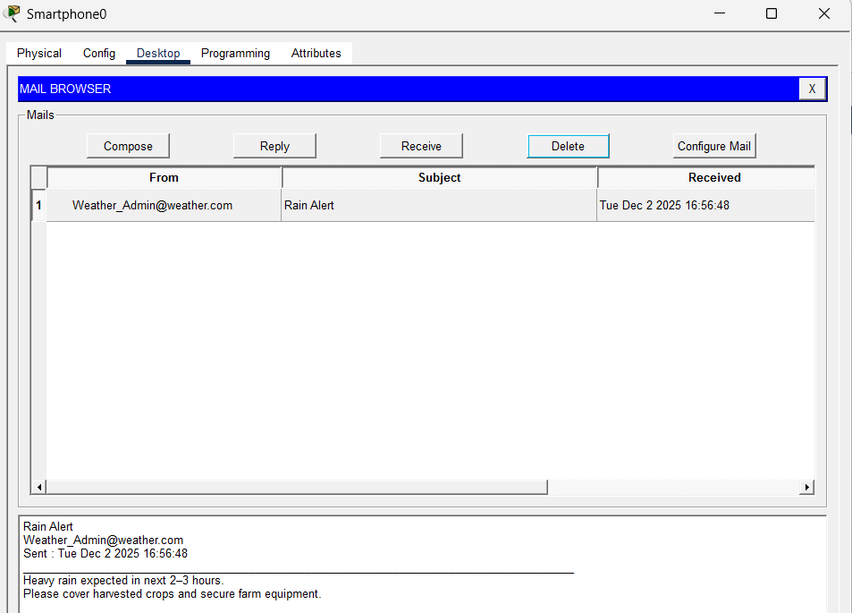

# Farmer Weather Alert System (Cisco Packet Tracer)

Unpredictable weather has become one of the biggest challenges in agriculture today. Farmers often rely on clear skies and experience when drying their harvested crops in open fields. However, rapid climate shifts mean that a sunny sky can turn into a sudden downpour within minutes.
These unexpected rains can destroy the final produce, leading to significant financial loss and discouragement.

This reality inspired the need for solutions that combine technology with ground-level farming problems.By providing early warnings, even a few minutes before a rainfall, such systems can help farmers take quick action to protect their harvest. A small alert can prevent a large loss.
My project "Farmer Weather Alert" 👨‍🌾🌦  — is designed to provide farmers with timely notifications to support weather-dependent tasks.
In agriculture, almost every activity— from drying harvested crops to irrigation, spraying, and field preparation — relies heavily on weather conditions. Sudden changes can disrupt work and cause significant losses.

This prototype is a demo model created for learning. It does not fetch real-time weather data yet. However, the concept can be further developed and implemented using actual sensors or API-based weather updates to make it practical for real-world use.

---

## Project Purpose
The system will help farmers receive early weather alerts so they can protect crops and equipment.  
It uses:

- Weather Server (Email + Web)
- DNS Server
- 2911 Router
- Switch
- Wi-Fi routers for 3 villages
- Smartphones, Laptops, and PCs
- Weather_Admin_PC for sending alerts

---

## Network Topology
### Figure 1: Overall Network Topology

---

## Connectivity Test
### Figure 2: Ping Results (Village ↔ Server)

---

## Web-Based Weather Access
### Figure 3: Accessing Weather Alerts via DNS

### Figure 4: Viewing Weather Alerts on Server

---

## Email Alert Delivery
### Figure 5: Weather Alert Sent

### Figure 6: Farmer Receiving Alert

---

## How to Run
1. Open `project_weather.pkt` in Cisco Packet Tracer  
2. Open any smartphone → Email → Receive  
3. Weather_Admin_PC → Email → Compose → Send alerts  
4. Open browser on a PC/smartphone → type:  
   `http://weather.com`  
5. Run ping tests to verify network connectivity  

---

## Author
SAMRUDDHI VINOD NIKAM
